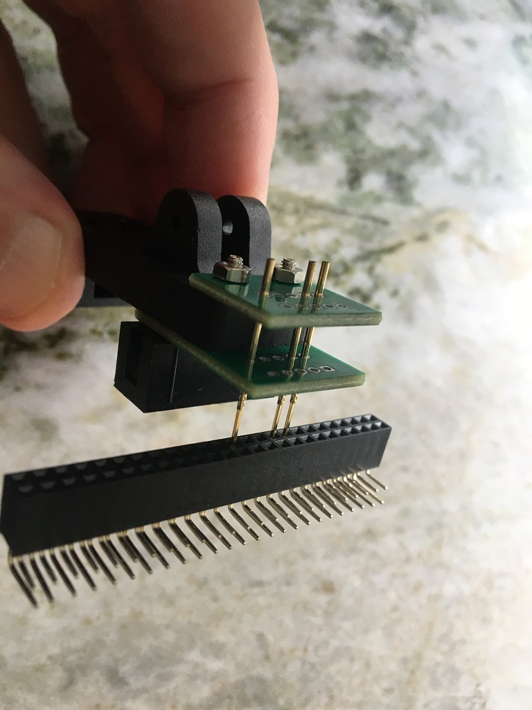

# JTAG-Connect
USB-blaster programming the intel/altera FPGA using a DIY spring clip with pogo-pins that clips onto a standard 2.0 mm pin pitch SMD-footprint:

 

 

***

video with the spring clip in action:
https://drive.google.com/file/d/1q0D7EuQR9gsi54iwchI4ziomZzsiyqWE/view?usp=sharing

I have spare PCBs in case anyone is interested in this, or I can make to order for a fiver + shipping (until my spares are depleted) in case anyone can't build themselves. You will have to source the DIY clip (including screws) yourself from [aliexpress](https://www.aliexpress.com/item/1005004383076344.html) or similar. 
my email: jorgen.bilander at gmail com

***

 

Designed for the common DIY spring clip plenty available on AliExpress:

***

A PCB panel also with a 6-pin version and handheld versions of the two:

***

When ordering from JLCPCB select:

Delivery Format: 

    Panel by Customer

Remove Order Number: 

    Specify a location

This will notify JLC where to put the order number, they will replace the "JLCJLCJLCJLC" silkscreen label.

And write a comment about V-scoring is specified on the User-Comment layer.

***

### Soldering the DIY clip PCBs:

 
Start with the back row (it will be easier to solder) and you can use a 2.0 mm pin pitch connector as a Jig to get the square top pins aligned. 

 

</a>

### Soldering the Handheld version:

I used a 2.0 mm pin pitch connector as a Jig to hold the pins in place at a nice consistant distance:

</a>

 

***

[![CC BY-SA 4.0][cc-by-sa-shield]][cc-by-sa]

This work is licensed under a
[Creative Commons Attribution-ShareAlike 4.0 International License][cc-by-sa].

[![CC BY-SA 4.0][cc-by-sa-image]][cc-by-sa]

[cc-by-sa]: http://creativecommons.org/licenses/by-sa/4.0/
[cc-by-sa-image]: https://licensebuttons.net/l/by-sa/4.0/88x31.png
[cc-by-sa-shield]: https://img.shields.io/badge/License-CC%20BY--SA%204.0-lightgrey.svg
